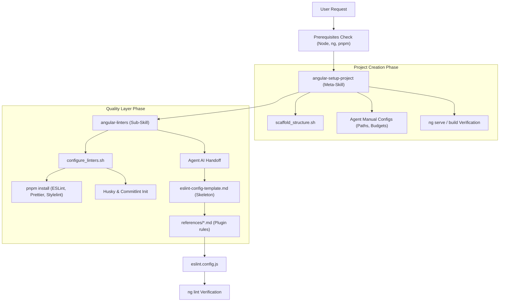
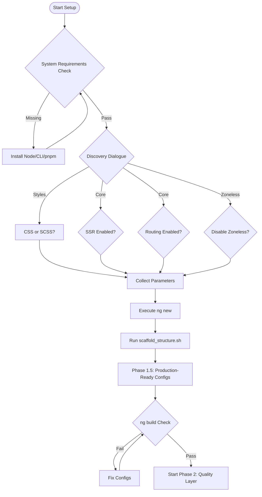

# Angular Skills Ecosystem Architecture

This document outlines the architecture, decision trees, and workflows for the Angular project setup and quality layering skills.

## 🏗 System Architecture

The ecosystem is designed with a **Meta-Skill** pattern, where a high-level orchestrator delegates specialized tasks to sub-skills and shell scripts.

---

## 🚦 Decision Tree: Project Bootstrapping

The following tree describes the interactive discovery and creation logic used by `angular-setup-project`.

---

## 🛠 Quality Layer Integration Workflow

The integration follows a "Shell-Agent Handoff" model to combine deterministic installation with intelligent configuration.

1.  **Orchestration**: `angular-linters` runs `configure_linters.sh`.
2.  **Installation**: The script handles all `pnpm` dependencies and creates boilerplate config files.
3.  **Handoff**: The script signals the Agent to build the complex `eslint.config.js`.
4.  **Composition**: The Agent uses `eslint-config-template.md` as the structural base and populates it with logic from:
    - `parser-config.md`
    - `import-x-and-unused-imports.md`
    - `rxjs.md`
    - `prettier.md`
5.  **Validation**: Every integration step must be verified via `ng lint` or `stylelint`.

---

## 📁 Directory Structure

- `angular-setup-project/`
  |__ `scripts/`
  |__ `SKILL.md`
- `angular-linters/`
  |__ `scripts/`
  |__ `references/`
  |__ `SKILL.md`
